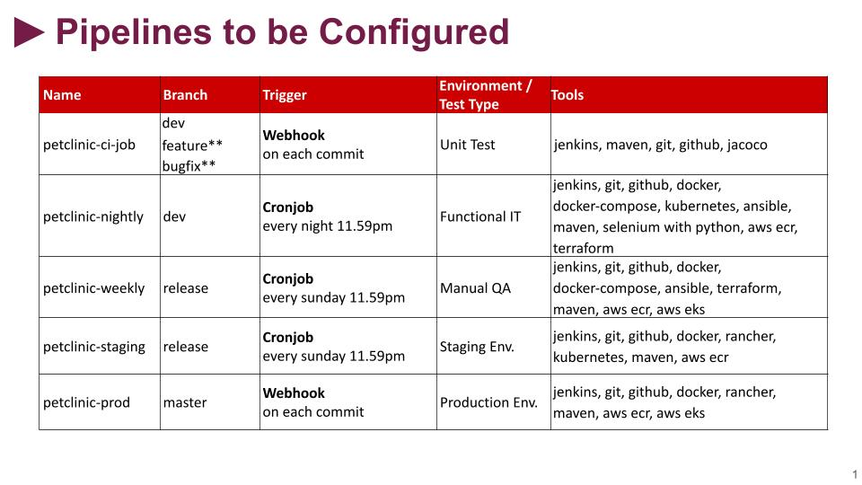

# Project 505: Microservices CI/CD Pipeline

## Description

This project aims to create full CI/CD Pipeline for microservice based applications using [Spring Petclinic Microservices Application](https://github.com/spring-petclinic/spring-petclinic-microservices). Jenkins Server deployed on Elastic Compute Cloud (EC2) Instance is used as CI/CD Server to build pipelines.

## DevOps Pipelines

### Development Diagram

### Pipelines Configurations

### Pipelines Overview

## Flow of Tasks for Project Realization

| Epic | Task  | Task #  | Task Definition   | Branch  |
| ---   | :---  | ---                  | :---              | :---    |
| Local Development Environment | Prepare Development Server Manually on EC2 Instance| MSP-1 | Prepare development server manually on Amazon Linux 2 for developers, enabled with `Docker` , `Docker-Compose` , `Java 11` , `Git` .  |
| Local Development Environment | Prepare GitHub Repository for the Project | MSP-2-1 | Clone the Petclinic app from the Clarusway repository [Petclinic Microservices Application](https://github.com/clarusway/petclinic-microservices.git) |
| Local Development Environment | Prepare GitHub Repository for the Project | MSP-2-2 | Prepare base branches namely `main` , `dev` , `release` for DevOps cycle. |
| Local Development Environment | Check the Maven Build Setup on Dev Branch | MSP-3 | Check the Maven builds for `test` , `package` , and `install` phases on `dev` branch |
| Local Development Environment | Prepare a Script for Packaging the Application | MSP-4 |  Prepare a script to package the application with Maven wrapper | feature/msp-4 |
| Local Development Environment | Prepare Development Server Terraform Files | MSP-5 |  Prepare development server folder with Terraform File for developers, enabled with `Docker` , `Docker-Compose` , `Java 11` , `Git` . | feature/msp-5 |
| Local Development Build | Prepare Dockerfiles for Microservices | MSP-6 | Prepare Dockerfiles for each microservices. | feature/msp-6 |
| Local Development Environment | Prepare Script for Building Docker Images | MSP-7 |  Prepare a script to package and build the docker images for all microservices. | feature/msp-7 |
| Local Development Build | Create Docker Compose File for Local Development | MSP-8-1 |  Prepare docker compose file to deploy the application locally. | feature/msp-8 |
| Local Development Build | Create Docker Compose File for Local Development | MSP-8-2 |  Prepare a script to test the deployment of the app locally. | feature/msp-8 |
| CI Server Setup | Prepare Jenkins Server | MSP-9 | Prepare Jenkins Server for CI/CD Pipeline. | feature/msp-9 |
| CI Server Setup | Configure Jenkins Server for Project | MSP-10  | Configure Jenkins Server for Project Setup. | 
| Testing Environment Setup | Implement Unit Tests | MSP-11-1  | Implement 3 Unit Tests locally. | feature/msp-11 |
| Testing Environment Setup | Setup Code Coverage Tool | MSP-11-2  | Update POM file for Code Coverage Report. | feature/msp-11 |
| Testing Environment Setup | Implement Code Coverage | MSP-11-3  | Generate Code Coverage Report manually. | feature/msp-11 |
| CI Server Setup | Prepare CI Pipeline | MSP-12 | Prepare CI pipeline (UT only) for all `dev` , `feature` and `bugfix` branches. | feature/msp-1 |
| Testing Environment Setup | Prepare Selenium Tests | MSP-13-1  | Prepare 3 Selenium Jobs for QA Automation Tests. | feature/msp-13 |
| Testing Environment Setup | Implement Selenium Tests | MSP-13-2  | Run 3 Selenium Tests against local environment. | feature/msp-13 |
| Registry Setup for Development | Create Docker Registry for Dev Manually | MSP-14  | Create Docker Registry on AWS ECR manually using Jenkins job. | feature/msp-14 |
| QA Automation Setup for Development | Create a QA Automation Environment - Part-1 | MSP-15  | Create a QA Automation Environment with Kubernetes. | feature/msp-15 |
| QA Automation Setup for Development | Create a QA Automation Environment - Part-2 | MSP-16  | Create a QA Automation Environment with Kubernetes. | feature/msp-16 |
| QA Automation Setup for Development | Prepare Petlinic Kubernetes YAML Files | MSP-17  | Prepare Petlinic Kubernetes YAML Files. | feature/msp-17 |
| QA Automation Setup for Development | Prepare a QA Automation Pipeline | MSP-18  | Prepare a QA Automation Pipeline on `dev` branch for Nightly Builds. | feature/msp-18 |
| QA Setup for Release | Create a QA Infrastructure with eksctl | MSP-19  | Create a Permanent QA Infrastructure for Kubernetes Cluster with eksctl. | feature/msp-19 |
| QA Setup for Release | Prepare Build Scripts for QA Environment | MSP-20  | Prepare Build Scripts for QA Environment | feature/msp-20 |
| QA Setup for Release | Build and Deploy App on QA Environment Manually | MSP-21  | Build and Deploy App for QA Environment Manually using Jenkins Jobs. | feature/msp-21 | 
| QA Setup for Release | Prepare a QA Pipeline | MSP-22  | Prepare a QA Pipeline using Jenkins on `release` branch for Weekly Builds. | feature/msp-22 |
| Staging and Production Setup | Prepare HA RKE Kubernetes Cluster | MSP-23  | Prepare High-availability RKE Kubernetes Cluster on AWS EC2 | feature/msp-23 |
| Staging and Production Setup | Install Rancher App on RKE K8s Cluster | MSP-24  | Install Rancher App on RKE Kubernetes Cluster| |
| Staging and Production Setup | Create Staging and Production Environment with Rancher | MSP-25  | Create Staging and Production Environment with Rancher by creating new cluster for Petclinic | |
| Staging Deployment Setup | Prepare and Configure Nexus Server | MSP-26  | Create and Configure Nexus Server for Pipelines | feature/msp-26|
| Staging Deployment Setup | Prepare a Staging Pipeline | MSP-27  | Prepare a Staging Pipeline on Jenkins Server | feature/msp-27|
| Production Deployment Setup | Prepare a Production Pipeline | MSP-28  | Prepare a Production Pipeline on Jenkins Server | feature/msp-28|
| Production Deployment Setup | Set Domain Name and TLS for Production | MSP-29  | Set Domain Name and TLS for Production Pipeline with Route 53 | feature/msp-29|
| Production Deployment Setup | Set Monitoring Tools | MSP-30  | Set Monitoring tools, Prometheus and Grafana | |
